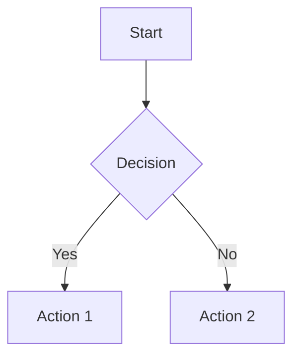

# Bazel File Operations Component Documentation

This directory contains the documentation site for the Bazel File Operations Component, built with [Astro](https://astro.build/) and [Starlight](https://starlight.astro.build/).

## Quick Start

```bash
# Install dependencies
npm install

# Start development server
npm run dev

# Build for production
npm run build

# Preview production build
npm run preview
```

## Documentation Structure

```
docs-site/
├── src/
│   ├── content/
│   │   └── docs/                    # Documentation pages
│   │       ├── index.mdx            # Homepage
│   │       ├── installation/        # Installation guide
│   │       ├── getting-started/     # Quick start guide
│   │       ├── integration/         # Integration patterns
│   │       ├── security/            # Security configuration
│   │       ├── api-reference/       # Complete API docs
│   │       ├── examples/            # Usage examples
│   │       └── troubleshooting/     # Common issues
│   └── styles/
│       └── custom.css               # Custom styling
├── astro.config.mjs                 # Astro configuration
└── package.json                     # Dependencies
```

## Features

- **Interactive Mermaid Diagrams**: Click diagrams to view full-size
- **Code Syntax Highlighting**: Full support for Starlark/Bazel syntax
- **Responsive Design**: Mobile-friendly documentation
- **Search**: Full-text search powered by Pagefind
- **Auto-generated Navigation**: Sidebar generated from folder structure

## Deployment

### Automated Deployment

The documentation is automatically deployed via GitHub Actions:

- **GitHub Pages**: Deployed on every push to `main` branch
- **Custom Domain**: Can be configured for `https://bazel-file-ops.pulseengine.eu`

### Manual Deployment

For manual deployment to other platforms:

```bash
# Build the site
npm run build

# Deploy to Netlify
npm install -g netlify-cli
netlify deploy --prod --dir=dist

# Deploy to Vercel
npm install -g vercel
vercel --prod

# Deploy to custom server
rsync -avz --delete dist/ user@server:/path/to/site/
```

## Development

### Adding New Pages

1. Create a new `.mdx` file in `src/content/docs/`
2. Add frontmatter with `title` and `description`
3. The sidebar will auto-update based on folder structure

Example:

```mdx
---
title: My New Page
description: Description of the new page
---

# My New Page

Content goes here...
```

### Custom Components

Use Starlight's built-in components:

```mdx
import { Card, CardGrid, Tabs, TabItem, Badge } from '@astrojs/starlight/components';

<CardGrid>
  <Card title="Feature 1" icon="star">
    Description of feature 1
  </Card>
</CardGrid>
```

### Mermaid Diagrams

Add interactive diagrams:



## Configuration

### Astro Configuration

Key configuration in `astro.config.mjs`:

- **Site URL**: `https://bazel-file-ops.pulseengine.eu`
- **Base URL**: Configured for GitHub Pages
- **Integrations**: Mermaid, Starlight
- **Code Highlighting**: Starlark/Bazel syntax support

### Starlight Configuration

- **Title**: "Bazel File Operations Component"
- **Theme**: Dark/light mode support
- **Social Links**: GitHub repository
- **Edit Links**: Direct GitHub editing
- **Search**: Enabled with Pagefind

## Troubleshooting

### Build Issues

**MDX parsing errors:**

- Check for unescaped `<` characters in text
- Ensure all JSX components are properly closed
- Validate YAML frontmatter

**Missing pages in sidebar:**

- Ensure `.mdx` files have proper frontmatter
- Check file naming conventions
- Verify folder structure matches expected patterns

**Mermaid diagram issues:**

- Validate diagram syntax
- Check for reserved keywords
- Ensure proper indentation

### Development Server Issues

```bash
# Clear cache and restart
rm -rf node_modules/.cache
npm run dev

# Check for port conflicts
lsof -i :4321
```

### Deployment Issues

**GitHub Pages:**

- Ensure `docs.yml` workflow has proper permissions
- Check GitHub Pages settings in repository
- Verify site URL in `astro.config.mjs`

**Custom Domain:**

- Update DNS records
- Configure SSL certificates
- Update base URL in configuration

## Contributing

1. **Documentation Updates**: Edit `.mdx` files in `src/content/docs/`
2. **Styling Changes**: Modify `src/styles/custom.css`
3. **Configuration**: Update `astro.config.mjs`
4. **Testing**: Run `npm run build` to verify changes

## Resources

- [Astro Documentation](https://docs.astro.build/)
- [Starlight Documentation](https://starlight.astro.build/)
- [Mermaid Syntax](https://mermaid.js.org/)
- [MDX Documentation](https://mdxjs.com/)

Built with ❤️ for the Bazel community by [Pulse Engine](https://pulseengine.eu).
