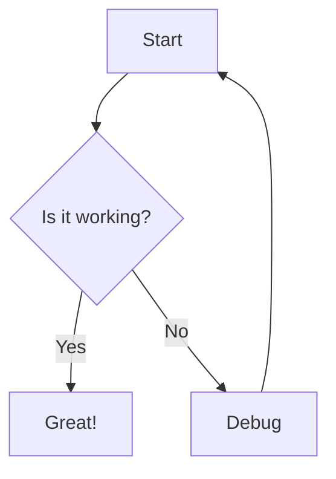

```mermaid
architecture-beta
  group api(logos:aws-lambda)[API]

  service db(logos:postgresql)[Database] in api
  service disk1(logos:aws-s3)[Storage] in api
  service disk2(logos:cloudflare)[CDN] in api
  service server(logos:docker)[Server] in api

  db:L -- R:server
  disk1:T -- B:server
  disk2:T -- B:db
```

# astro-mermaid

An Astro integration for rendering Mermaid diagrams with automatic theme switching and client-side rendering. This follows the mermaid integration in [cloudflare-docs](https://github.com/cloudflare/cloudflare-docs)

## Features

- 🎨 Automatic theme switching based on your site's theme
- 🚀 Client-side rendering for optimal performance
- 📝 Simple markdown syntax using code blocks
- ⚡ Vite optimization for fast development
- 🔧 Customizable mermaid configuration
- 🎯 TypeScript support
- 🔒 Privacy-focused with no external server dependencies
- 🌐 Offline-capable rendering
- ⚡ Zero network latency for diagram generation
- 📦 Conditional loading - mermaid.js only loads on pages with diagrams
- 🎭 Smooth loading animations to prevent layout shifts

## Installation

```bash
npm install astro-mermaid mermaid
```

## Usage

Add the integration to your `astro.config.mjs`:

```js
import { defineConfig } from 'astro/config';
import mermaid from 'astro-mermaid';

export default defineConfig({
  integrations: [
    mermaid({
      theme: 'forest'
    })
  ]
});
```

### Important: Integration Order

When using with Starlight or other integrations that process markdown, make sure to place the mermaid integration **before** them:

```js
import { defineConfig } from 'astro/config';
import starlight from '@astrojs/starlight';
import mermaid from 'astro-mermaid';

export default defineConfig({
  integrations: [
    mermaid(), // Must come BEFORE starlight
    starlight({
      title: 'My Docs'
    })
  ]
});
```

Then use mermaid code blocks in your markdown files:

````markdown

````

## Configuration

```js
mermaid({
  // Default theme: 'default', 'dark', 'forest', 'neutral', 'base'
  theme: 'forest',
  
  // Enable automatic theme switching based on data-theme attribute
  autoTheme: true,
  
  // Additional mermaid configuration
  mermaidConfig: {
    flowchart: {
      curve: 'basis'
    }
  },
  
  // Register icon packs for use in diagrams
  iconPacks: [
    {
      name: 'logos',
      loader: () => fetch('https://unpkg.com/@iconify-json/logos@1/icons.json').then(res => res.json())
    },
    {
      name: 'iconoir',
      loader: () => fetch('https://unpkg.com/@iconify-json/iconoir@1/icons.json').then(res => res.json())
    }
  ]
})
```

## Icon Packs

You can register icon packs to use custom icons in your diagrams. Icon packs are loaded from Iconify JSON sources:

```js
iconPacks: [
  {
    name: 'logos',
    loader: () => fetch('https://unpkg.com/@iconify-json/logos@1/icons.json').then(res => res.json())
  }
]
```

Then use icons in your diagrams:

````markdown

````

## Theme Switching

If `autoTheme` is enabled (default), the integration will automatically switch between themes based on your site's `data-theme` attribute:

- `data-theme="light"` → uses 'default' mermaid theme
- `data-theme="dark"` → uses 'dark' mermaid theme

## Client-Side Rendering & Security

### 🔒 Privacy & Security Benefits

This integration uses **100% client-side rendering** with zero external dependencies at runtime:

- **No Data Transmission**: Your diagram content never leaves your browser
- **No External Servers**: No calls to mermaid.live or any external services
- **Offline Capable**: Works completely offline after initial page load
- **Zero Network Latency**: Instant diagram rendering without network delays
- **Corporate Firewall Friendly**: No external domains need to be whitelisted

### ⚡ How It Works

1. **Build Time**: Mermaid code blocks are transformed to `<pre class="mermaid">` elements
2. **Runtime**: The bundled Mermaid JavaScript library renders diagrams locally
3. **Output**: Pure SVG generated entirely in your browser

```javascript
// All rendering happens locally - no network calls
import mermaid from 'mermaid';
const { svg } = await mermaid.render(id, diagramDefinition);
```

### 🛡️ Enterprise & Compliance

Perfect for:
- Corporate environments with strict security policies
- GDPR/privacy-compliant applications  
- Air-gapped or restricted network environments
- Applications requiring data sovereignty
- High-security environments where external requests are prohibited

## Supported Diagrams

All mermaid diagram types are supported:

- Flowcharts
- Sequence diagrams
- Gantt charts
- Class diagrams
- State diagrams
- Entity Relationship diagrams
- User Journey diagrams
- Git graphs
- Pie charts
- Requirement diagrams
- C4 diagrams
- Mindmaps
- Timeline diagrams
- Quadrant charts
- And more!

## Demo

Check out the [live demo](https://starlight-mermaid-demo.netlify.app/) built with Starlight.

## Contributing

Contributions are welcome! Please feel free to submit a Pull Request.

## License

MIT
