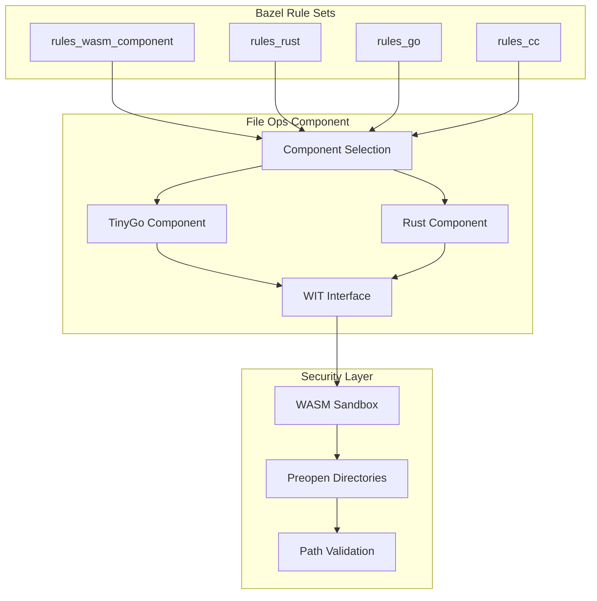

import { Card, CardGrid } from '@astrojs/starlight/components';

## Why File Operations Component?

Traditional Bazel rule sets rely on shell scripts and platform-specific commands for file operations, leading to inconsistencies across Windows, macOS, and Linux. This component provides a secure, unified solution through WebAssembly.

<CardGrid stagger>
  <Card title="🔒 Enhanced Security" icon="shield">
    WebAssembly sandboxing with wasmtime preopen directories prevents unauthorized file access and path traversal attacks.
  </Card>

  <Card title="🌍 Cross-Platform" icon="laptop">
    Works identically on Linux, macOS, and Windows without platform-specific code or dependencies.
  </Card>

  <Card title="⚡ Dual Implementation" icon="rocket">
    Choose between TinyGo (security-focused) and Rust (performance-optimized) based on your needs.
  </Card>

  <Card title="🔄 Backward Compatible" icon="puzzle">
    Supports existing JSON batch processing workflows while offering modern individual operation APIs.
  </Card>
</CardGrid>

## Architecture Overview



## Key Features

### Secure by Design
- **WebAssembly Sandboxing**: Components run in isolated environments
- **Preopen Directories**: Only specified directories are accessible
- **Capability-Based Security**: No access outside designated paths
- **Runtime Validation**: Path traversal protection at WASM level

### Performance Optimized
- **Smart Implementation Selection**: Automatic choice between TinyGo and Rust
- **Minimal Overhead**: Optimized WASM runtime with fast startup
- **Efficient File Operations**: Streaming I/O for large files
- **Caching**: Component reuse across operations

### Developer Friendly
- **JSON Compatibility**: Works with existing batch processing workflows
- **Individual Operations**: Direct API calls for specific operations
- **Rich Documentation**: Comprehensive guides and examples
- **Easy Integration**: Simple integration with any Bazel rule set

## Quick Example

### JSON Batch Processing (Backward Compatible)
```json
{
  "workspace_dir": "/build/workspace",
  "operations": [
    {"type": "copy_file", "src_path": "/src/main.cpp", "dest_path": "main.cpp"},
    {"type": "mkdir", "path": "include"},
    {"type": "copy_directory", "src_path": "/headers", "dest_path": "include"}
  ]
}
```

### Individual Operations (New API)
```starlark
load("@bazel_file_ops_component//toolchain:defs.bzl", "file_ops_action")

file_ops_action(
    name = "setup_workspace",
    implementation = "tinygo",  # High security
    operations = [
        {"operation": "copy_file", "src": "source.cpp", "dest": "workspace/source.cpp"},
        {"operation": "create_directory", "path": "workspace/include"},
    ],
    security_level = "high",
)
```

## Getting Started

1. **[Installation](/installation/)** - Add to your Bazel workspace
2. **[First Operations](/first-operations/)** - Run your first file operations
3. **[Integration Guide](/integration/rules-wasm-component/)** - Integrate with your rule set
4. **[Security Configuration](/security/levels/)** - Configure security settings

## Community & Support

- **GitHub Repository**: [pulseengine/bazel-file-ops-component](https://github.com/pulseengine/bazel-file-ops-component)
- **Issues & Bug Reports**: [GitHub Issues](https://github.com/pulseengine/bazel-file-ops-component/issues)
- **Discussions**: [GitHub Discussions](https://github.com/pulseengine/bazel-file-ops-component/discussions)
- **Contributing**: [Contribution Guidelines](https://github.com/pulseengine/bazel-file-ops-component/blob/main/CONTRIBUTING.md)

Built with ❤️ for the Bazel community by [Pulse Engine](https://pulseengine.eu).
