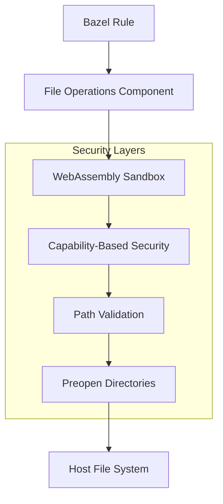
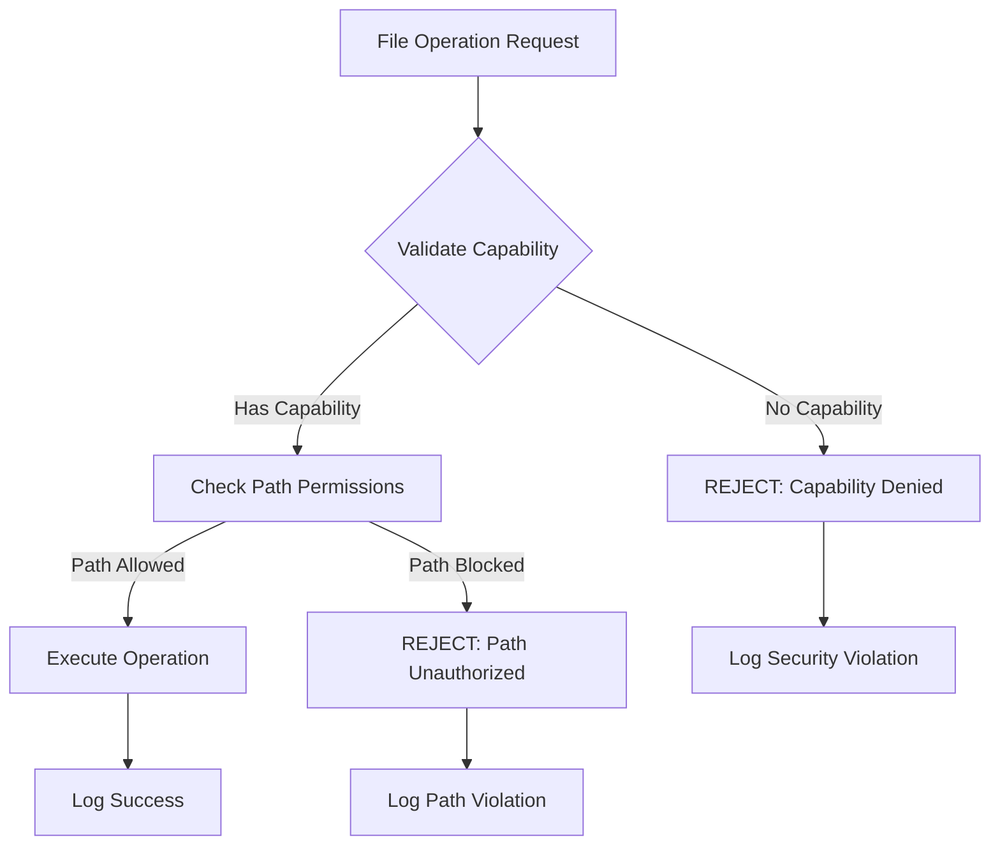

import { Code, Tabs, TabItem, Card, CardGrid, Badge } from '@astrojs/starlight/components';

## Security Model

The Bazel File Operations Component implements a **defense-in-depth** security model with multiple layers of protection:



<CardGrid>
  <Card title="🔒 WebAssembly Sandboxing" icon="shield">
    Complete isolation through WASM runtime with no direct system access
  </Card>
  <Card title="🛡️ Capability-Based Security" icon="lock-closed">
    Only explicitly granted file system capabilities are available
  </Card>
  <Card title="🔍 Path Validation" icon="magnifying-glass">
    Automatic prevention of path traversal and unauthorized access
  </Card>
  <Card title="📁 Preopen Directories" icon="folder-open">
    Restricted file access to only specified directory trees
  </Card>
</CardGrid>

## Security Levels

### High Security <Badge text="Recommended for Production" variant="tip" />

Maximum security with strict isolation and validation.

```python
file_ops_action(
    name = "secure_operations",
    security_level = "high",
    implementation = "tinygo",  # Most secure implementation
    allowed_paths = [
        "/tmp/bazel-workspace-safe",
        "/build/output"
    ],
    operations = [...],
)
```

**Features:**
- ✅ Maximum WebAssembly sandboxing
- ✅ Strict path traversal prevention
- ✅ Capability validation at every operation
- ✅ Minimal attack surface
- ✅ Detailed audit logging

**Use Cases:**
- Production builds
- Security-critical applications
- CI/CD pipelines
- Multi-tenant environments

### Standard Security <Badge text="Default" variant="note" />

Balanced security and performance for most use cases.

```python
file_ops_action(
    name = "standard_operations",
    security_level = "standard",  # Default
    operations = [...],
)
```

**Features:**
- ✅ WebAssembly sandboxing
- ✅ Path traversal prevention
- ✅ Basic capability validation
- ✅ Good performance
- ⚠️ Moderate audit logging

**Use Cases:**
- Development environments
- Standard build processes
- Testing workflows
- General file operations

### Low Security <Badge text="Development Only" variant="caution" />

Minimal security overhead for development and debugging.

```python
file_ops_action(
    name = "dev_operations",
    security_level = "low",
    operations = [...],
)
```

**Features:**
- ✅ Basic WebAssembly sandboxing
- ⚠️ Relaxed path validation
- ⚠️ Minimal capability checking
- ✅ Maximum performance
- ❌ No audit logging

**Use Cases:**
- Local development
- Debugging and troubleshooting
- Performance testing
- Prototyping

## Path Security

### Allowed Paths Configuration

Restrict file operations to specific directory trees:

<Tabs>
<TabItem label="Explicit Paths">
```python
file_ops_action(
    name = "restricted_ops",
    security_level = "high",
    allowed_paths = [
        "/tmp/bazel-workspace",      # Specific directory
        "/build/output",             # Build directory
        "/src/templates",            # Template directory
    ],
    operations = [...],
)
```
</TabItem>
<TabItem label="Pattern-Based">
```python
file_ops_action(
    name = "pattern_ops",
    allowed_paths = [
        "/tmp/bazel-*",              # Pattern matching
        "/workspace/*/build",        # Nested patterns
        "${BAZEL_WORKSPACE}/*",      # Environment variables
    ],
    operations = [...],
)
```
</TabItem>
</Tabs>

### Path Traversal Prevention

Automatic protection against common attacks:

```python
# These operations will be automatically blocked:
operations = [
    # ❌ Path traversal attempts
    {"operation": "copy_file", "src": "../../../etc/passwd", "dest": "stolen.txt"},
    {"operation": "copy_file", "src": "safe.txt", "dest": "../../../../tmp/escape.txt"},

    # ❌ Symlink attacks
    {"operation": "copy_file", "src": "/proc/version", "dest": "system_info.txt"},

    # ❌ Unauthorized system paths
    {"operation": "create_directory", "path": "/etc/malicious"},

    # ✅ Safe operations (allowed)
    {"operation": "copy_file", "src": "input.txt", "dest": "workspace/output.txt"},
    {"operation": "create_directory", "path": "workspace/build"},
]
```

### Dynamic Path Validation

Runtime path validation with context awareness:

```python
def _secure_build_impl(ctx):
    """Custom rule with dynamic path validation"""

    # Generate allowed paths based on build context
    workspace_path = ctx.bin_dir.path + "/workspace"
    output_path = ctx.genfiles_dir.path + "/output"

    file_ops_action(
        ctx = ctx,
        name = ctx.attr.name + "_secure",
        security_level = "high",
        allowed_paths = [workspace_path, output_path],
        operations = [
            {"operation": "create_directory", "path": workspace_path},
            {"operation": "copy_file",
             "src": ctx.file.input.path,
             "dest": workspace_path + "/input.txt"},
        ],
    )
```

## Capability-Based Security

### File System Capabilities

The component uses WASI capabilities to restrict file system access:

```python
# Capabilities are automatically configured based on operations
file_ops_action(
    name = "capability_example",
    operations = [
        # Requires: READ capability for source directory
        # Requires: WRITE capability for destination directory
        {"operation": "copy_directory", "src": "input/", "dest": "output/"},

        # Requires: WRITE + CREATE capability for directory creation
        {"operation": "create_directory", "path": "new_dir"},
    ],
    # Component automatically requests minimal required capabilities
)
```

### Capability Validation

Real-time capability checking prevents unauthorized operations:



## Implementation Security

### TinyGo Implementation <Badge text="Maximum Security" variant="tip" />

Designed for maximum security with minimal attack surface:

**Security Features:**
- Minimal binary size (~2MB) reduces attack vectors
- No complex dependencies or dynamic linking
- Optimized memory management with bounds checking
- Strict type safety and overflow protection
- Limited system call interface

**Use When:**
- Security is the top priority
- Handling sensitive data
- Multi-tenant or shared environments
- Compliance requirements

### Rust Implementation <Badge text="Performance Focused" variant="note" />

Balanced security and performance with advanced features:

**Security Features:**
- Memory safety guarantees from Rust
- Safe concurrency without data races
- Strong type system prevents many vulnerability classes
- Sandboxed execution environment
- Comprehensive error handling

**Use When:**
- High-performance requirements
- Complex file operations
- Advanced JSON processing needs
- Large-scale batch operations

## Audit and Monitoring

### Security Event Logging

Comprehensive logging of security-relevant events:

```python
file_ops_action(
    name = "audited_ops",
    security_level = "high",
    enable_audit_logging = True,
    operations = [...],
)
```

**Logged Events:**
- All file operations (with timestamps)
- Security policy violations
- Path traversal attempts
- Capability access requests
- Performance metrics
- Error conditions

### Log Format

```json
{
  "timestamp": "2024-08-24T10:30:45Z",
  "level": "INFO",
  "component": "file-ops-tinygo",
  "operation": "copy_file",
  "src_path": "/workspace/input.txt",
  "dest_path": "/output/result.txt",
  "security_level": "high",
  "allowed_paths": ["/workspace/*", "/output/*"],
  "duration_ms": 45,
  "bytes_processed": 1024,
  "result": "success"
}
```

### Security Violation Alerts

```json
{
  "timestamp": "2024-08-24T10:31:02Z",
  "level": "ERROR",
  "component": "file-ops-security",
  "violation_type": "PATH_TRAVERSAL",
  "attempted_path": "../../../../etc/passwd",
  "operation": "copy_file",
  "security_level": "high",
  "action": "BLOCKED",
  "source_rule": "//build:suspicious_copy"
}
```

## Advanced Security Configuration

### Environment-Specific Security

<Tabs>
<TabItem label="CI/CD Pipeline">
```python
# High security for CI/CD
file_ops_action(
    name = "ci_operations",
    security_level = "high",
    implementation = "tinygo",
    allowed_paths = [
        "/tmp/ci-workspace",
        "/artifacts/output",
    ],
    enable_audit_logging = True,
    max_file_size_mb = 100,  # Prevent DoS attacks
    max_operations = 1000,   # Rate limiting
)
```
</TabItem>
<TabItem label="Development">
```python
# Relaxed security for development
file_ops_action(
    name = "dev_operations",
    security_level = "standard",
    allowed_paths = [
        "${BAZEL_WORKSPACE}/*",
        "/tmp/dev-*",
    ],
    enable_debug_logging = True,
)
```
</TabItem>
<TabItem label="Production">
```python
# Maximum security for production
file_ops_action(
    name = "prod_operations",
    security_level = "high",
    implementation = "tinygo",
    allowed_paths = [
        "/production/workspace",
        "/production/output",
    ],
    enable_audit_logging = True,
    enable_integrity_checks = True,
    max_operation_time_sec = 300,
)
```
</TabItem>
</Tabs>

### Custom Security Policies

Define custom security policies for specific use cases:

```python
def _create_security_policy(environment, sensitivity_level):
    """Create security policy based on context"""

    if environment == "production" and sensitivity_level == "high":
        return {
            "security_level": "high",
            "implementation": "tinygo",
            "max_file_size_mb": 50,
            "max_operations": 500,
            "allowed_extensions": [".txt", ".json", ".cpp", ".h"],
            "enable_audit_logging": True,
            "enable_integrity_checks": True,
        }
    elif environment == "development":
        return {
            "security_level": "standard",
            "implementation": "auto",
            "enable_debug_logging": True,
            "relaxed_path_validation": True,
        }
    else:
        return {"security_level": "standard"}

file_ops_action(
    name = "policy_based_ops",
    **_create_security_policy("production", "high"),
    operations = [...],
)
```

## Compliance and Standards

### Security Standards Compliance

The component supports various security standards:

- **NIST Cybersecurity Framework**: Identify, Protect, Detect, Respond, Recover
- **OWASP Top 10**: Protection against common web application vulnerabilities
- **ISO 27001**: Information security management system requirements
- **SOC 2**: Security, availability, and confidentiality controls

### Compliance Configuration

```python
# SOC 2 compliant configuration
file_ops_action(
    name = "soc2_compliant_ops",
    security_level = "high",
    enable_audit_logging = True,
    enable_integrity_checks = True,
    enable_encryption_at_rest = True,  # For sensitive operations
    access_control_policy = "strict",
    operations = [...],
)

# PCI DSS compliant configuration (for payment processing)
file_ops_action(
    name = "pci_compliant_ops",
    security_level = "high",
    implementation = "tinygo",  # Minimal attack surface
    allowed_paths = ["/secure/cardholder-data"],
    enable_data_masking = True,
    require_encryption = True,
    operations = [...],
)
```

## Security Best Practices

### Rule Development

1. **Principle of Least Privilege**: Grant minimal required permissions
2. **Defense in Depth**: Use multiple security layers
3. **Fail Securely**: Default to secure settings on errors
4. **Input Validation**: Validate all file paths and operation parameters
5. **Audit Everything**: Log security-relevant events

### Deployment

1. **Environment Separation**: Use different security levels per environment
2. **Regular Updates**: Keep components and dependencies updated
3. **Security Monitoring**: Monitor logs for security violations
4. **Incident Response**: Have procedures for security incidents
5. **Regular Testing**: Test security configurations regularly

### Code Examples

<Tabs>
<TabItem label="Secure Rule Development">
```python
def _secure_file_processor_impl(ctx):
    """Example of secure rule development"""

    # Validate inputs
    if not ctx.attr.allowed_paths:
        fail("allowed_paths must be specified for security")

    # Use high security by default
    security_level = ctx.attr.security_level or "high"

    # Generate minimal required operations
    operations = []
    for src in ctx.files.srcs:
        # Validate file extension
        if not any(src.basename.endswith(ext) for ext in [".txt", ".json"]):
            fail(f"Unsupported file type: {src.basename}")

        operations.append({
            "operation": "copy_file",
            "src": src.path,
            "dest": f"workspace/{src.basename}",
            "preserve_metadata": True,
        })

    file_ops_action(
        ctx = ctx,
        name = ctx.attr.name + "_secure",
        operations = operations,
        security_level = security_level,
        allowed_paths = ctx.attr.allowed_paths,
        enable_audit_logging = True,
    )

secure_file_processor = rule(
    implementation = _secure_file_processor_impl,
    attrs = {
        "srcs": attr.label_list(allow_files = True, mandatory = True),
        "allowed_paths": attr.string_list(mandatory = True),
        "security_level": attr.string(default = "high"),
    },
)
```
</TabItem>
<TabItem label="Security Testing">
```python
def test_security_violations():
    """Test that security violations are properly blocked"""

    # Test path traversal prevention
    file_ops_test(
        name = "path_traversal_test",
        operations = [
            {"operation": "copy_file", "src": "../../../etc/passwd", "dest": "stolen.txt"},
        ],
        expect_failure = True,
        expected_error = "PATH_TRAVERSAL",
    )

    # Test unauthorized path access
    file_ops_test(
        name = "unauthorized_path_test",
        security_level = "high",
        allowed_paths = ["/tmp/safe"],
        operations = [
            {"operation": "create_directory", "path": "/etc/malicious"},
        ],
        expect_failure = True,
        expected_error = "UNAUTHORIZED_PATH",
    )
```
</TabItem>
</Tabs>

## Troubleshooting Security Issues

### Common Security Errors

**Path traversal blocked:**
```
ERROR: Path traversal detected in operation: ../../../sensitive/file.txt
Solution: Use absolute paths within allowed directories
```

**Unauthorized path access:**
```
ERROR: Path not in allowed list: /unauthorized/path
Solution: Add path to allowed_paths or use different destination
```

**Capability denied:**
```
ERROR: Missing capability for operation: WRITE
Solution: Ensure operation type matches required capabilities
```

**Sandbox violation:**
```
ERROR: WebAssembly sandbox violation: unauthorized system call
Solution: Review security level and implementation choice
```

### Security Debugging

```bash
# Enable security debug logging
export FILE_OPS_SECURITY_DEBUG=true
export FILE_OPS_LOG_LEVEL=debug

# Run with verbose security logging
bazel build --verbose_failures //:target

# Check security audit logs
bazel build //:target 2>&1 | grep "SECURITY:"
```

## Next Steps

- **[API Reference](/api-reference/)** - Detailed security-related API documentation
- **[Integration Guide](/integration/)** - Secure integration patterns
- **[Examples](/examples/)** - Security-focused examples
- **[Troubleshooting](/troubleshooting/)** - Security troubleshooting guide
